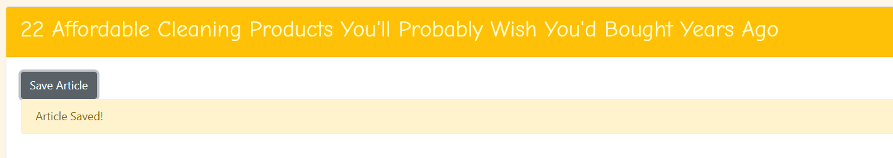

# All the News That's Fit to Scrape
This weeks assignment was to create a web app that let's users view and leave comments on the latest "news". Instead of populating the data on my own, Axios and Cheerios were used (in conjunction with Mongoose) to render the data. I chose to use the website BuzzFeed, as it has a good variety of different articles to view.
​
## Overview: 
To get a copy of the project working on your local machine to view and test the application, you will need MongoDB installed. For help installing MongoDB, visit:
````
https://docs.mongodb.com/manual/installation/
````
Once installed, make sure the MongoDB is running with the following command in your terminal:
````
$ mongod
````
### Installing
Git clone the repository to your local machine:
HTTPS:
```
$ git clone https://github.com/arohl2015/NewsScraper.git
```
SSH:
```
$ git clone git@github.com:arohl2015/NewsScraper.git
```
Next, cd into the repository and run the command
```
npm install
```
## Heroku Deployment

* Please go to the following link: `https://blooming-temple-08285.herokuapp.com/` 

## App Examples:
​




## Technologies Used:
-   HTML
-   CSS
-   Bootstrap
-   Google Fonts
-	Javascript
-	Node.js
-	NPM packages:
    -	Express
    -   Express-Handlebars
    -   Axios
    -   Cheerio
    -   Mongoose
-   Heroku
-   GitHub

#### Go to npmjs if you want to know more about:

1. **Express**:  https://www.npmjs.com/package/express
2. **Express-Handlebars**: https://www.npmjs.com/package/express-handlebars
3. **Axios**: https://www.npmjs.com/package/axios
4. **Cheerio**: https://www.npmjs.com/package/cheerio
5. **Mongoose**: https://www.npmjs.com/package/mongoose

## Future Enhancements:
In the future, I'd like to convert this type of web scraping application to React and use a different website to scrape data from to more easily display additional fields outside of just a link and article title.
###### Please Note:
I had some issues with rendering my data on the webpage. My articles scrape, but they don't update (you can see them in the terminal if you run the application locally) and I was having problems with saving notes and deleting articles.

## Connect with Me & View my Work:
- <a href="https://arohl2015.github.io/Updated-Portfolio/" target="_blank"> Portfolio </a>
- <a href="https://github.com/arohl2015" target="_blank"> GitHub </a>
- <a href="https://www.linkedin.com/in/aprilrohlcfp/" target="_blank"> LinkedIn </a>
